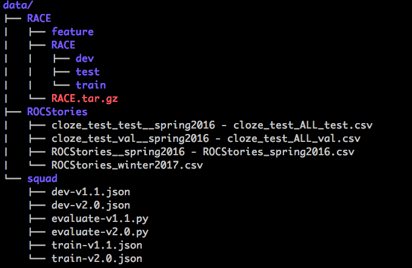

# LMPresent

Including pre-trained language models for fine-tuning on other NLP tasks

So far I've collected 3 pre-trained LM, including GPT, ELMo and BERT.

I mainly re-produce and fine-tune these models on the RACE dataset and the experimental results are shown in the following sections.

Hope this repo can help you extend these pre-trained models to other tasks.

## bert

This dir includes the BERT model. Here we present expemeriments on the RACE dataset and the SQuAD dataset(version 1 and version 2)

### Run on WikiQA

`bash run_classifier_wikiqa.sh`: run fine-tuning experiments on WikiQA

### Run on RACE

`bash run_classifier_RACE.sh`: run fine-tuning experiments on RACE

`bash extract_features_RACE.sh`: extract and dump representations of RACE to the local disk

### Run on SQuAD

`run_squad.sh`: run fine-tuning experiments on SQuAD v1.1

`run_squad_score.sh`: calclulate EM and F1 scores and the best threshold for the null answer on SQuAD v1.1

`run_squad2.0.sh`: run fine-tuning experiments on SQuAD v2

`run_squad2.0_score.sh`: calclulate EM and F1 scores and the best threshold for the null answer

`run_squad2.0_with_best_thres.sh`: rerun(only predict) the model with the best threshold

## bilm-tf

This dir includes the ELMo model. Here we present experiments on the RACE dataset.

**NOTE: This repo must be run in the python3 environment!**

### Run on RACE

`python run_race.py`

### Run on SQuAD

TO DO!

## finetune-transformer-lm

This dir includes the GPT model. This is the original repo which refers to [openai/finetune-transformer-lm](https://github.com/openai/finetune-transformer-lm) and it includes experiments on the ROCStories dataset.

**NOTE: you can download pre-trained params from [openai/finetune-transformer-lm](https://github.com/openai/finetune-transformer-lm).**

### Run on ROCStories

`bash run.sh`

## finetune-transformer-lm_RACE

This dir includes the GPT model. This is the modified repo which refers to [openai/finetune-transformer-lm](https://github.com/openai/finetune-transformer-lm) and it includes experiments on the RACE dataset.

### Run on RACE

`bash run.sh`

## Experiental results

### WikiQA

| epochs | batch size | max input length |  model | Overlap | MAP | MRR | device |
| :--------: |:------:|:------:|:------:|:------:|:------:|:------:|:------:|
| 3   | 1 | 256| BERT | 243/633 | 76.5  | 78.0 | 1 GTX 1080 |

### RACE

| epochs | batch size | max input length |  model | Accuracy (%) on dev | Accuracy (%) on test |Accuracy (%) on middle test |Accuracy (%) on high test | device |
| :--------: |:------:|:------:|:------:|:------:|:------:|:------:|:------:|:------:|
| 3   | 1 | 320| GPT | 52.22  | 51.54 | 53.90 | 50.57 | 1 GTX 1080 |
| 3   | 1 | 512| BERT | 55.65  | 54.11 | 59.26 | 52.00 | 1 GTX 1080 |
| 3   | 8 | 512/32 | ELMo | 39.39  | 38.57 | 38.23 | 39.02 | 1 GTX 1080 |
| 25   | 8 | 512/32 | ELMo | 40.64  | 38.04 | 37.67 | 38.25 | 1 GTX 1080 |

Analysis: from the chart above we can see that BERT behaves better than GPT on RACE, and ELMo performs much poorly. I only fine-tune a dense layer both for BERT and GPT, and I fine-tune a bilinear attention layer and a bilinear dot operation for ELMo. **The reason why ELMo behaves poorly is that vector representations extracted from ELMo are individual between articles and questions(also options if considered)**.

### SQuAD

The results are based on the dev set and the `BERT-Base, Uncased Model`.

| epochs | batch size | max input length |  model | dataset|EM (%) | F1 (%) | device |
| :--------: |:------:|:------:|:------:|:------:|:------:|:------:|:------:|
| 3 | 6 | 384| BERT | v1.1 | 81.15  | 88.51 | 1 GTX 1080 |
| 3 | 6 | 384| BERT | v2 | 76.45  | 73.12 | 1 GTX 1080 |

### ROCStories

| epochs | batch size |  model | Accuracy (%) on dev  |Accuracy (%) on test | device |
| :--------: |:------:|:------:|:------:|:------:|:------:|
| 3 | 8 | GPT | 89.57 | 84.77 | 1 GTX 1080 |

## More details

The `data` dir structure is shown as:

## References

* [google-research/bert](https://github.com/google-research/bert)
* [openai/finetune-transformer-lm](https://github.com/openai/finetune-transformer-lm)
* [allenai/bilm-tf](https://github.com/allenai/bilm-tf)

